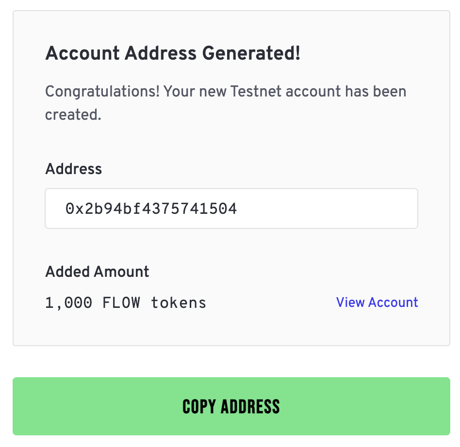

## Flow EVM Example

Welcome to Flow EVM! This is an example project to help you get started working with Flow EVM using familiar EVM tooling
as well as interacting with EVM from the Cadence environment

> :information_source: If you haven't already, check out the HelloWorld quick start guide to get rolling with Flow EVM
> using the EVM tooling you know and love. This guide will take you a step further, introducing you to the Cadence
> environment and how to orchestrate EVM interactions from Cadence.

## Overview

In this example, we're going to a set of smart contracts that codify a simple onchain lottery. The lottery "admin" will
be `CadenceOwnedAccount` (COA) which resides in a Cadence contract. This Cadence contract will have a single public
method that enables committment of a verifiably random number retrieved from the Cadence execution environment to the
lottery contract running in EVM.

Throughout this example, you'll learn how to:
- Deploy a Cadence contract
- Deploy an EVM contract using a `CadenceOwnedAccount`
- Query EVM state from Cadence
- Conditionally execute EVM state change from Cadence
- Orchestrate arbitrary calls to EVM from the Cadence runtime

## Walkthrough

### Pre-requisites

You'll need Foundry to interact with Flow EVM from the CLI as well as Flow CLI to interact with the Flow blockchain.

- [MetaMask installed & configured for Flow EVM PreviewNet funded with $FLOW](https://developers.flow.com/evm/using)
- [Flow CLI installation](https://developers.flow.com/tools/flow-cli/install)
- [[Optional] Foundry installation](https://book.getfoundry.sh/getting-started/installation) to compile Solidity
  contract

### Step 1: Create a Flow account

Generate a public/private key pair from which we'll create a Flow account using the PreviewNet faucet.

```sh
flow keys generate
```

Resulting in something like:

```
🔴️ Store private key safely and don't share with anyone!
Private Key             <PRIVATE_KEY>
Public Key 		        <PUBLIC_KEY>
Mnemonic 		        <MNEMONIC_PHRASE>
Derivation Path 	    m/44'/539'/0'/0/0
Signature Algorithm     ECDSA_P256
```

Next copy the public key, go to the [PreviewNet faucet](https://previewnet-faucet.onflow.org/) and paste the public key
value. Complete the Captcha (assuming you're not a robot) and click "Create Account". You should see a message
indicating the created address and your new account's PreviewNet $FLOW balance like so:



With that account created, you'll need to copy the private key you generated to the `previewnet-lottery.pkey`, so run
the following command, also pasting your private key where named:

```sh
cp previewnet-lottery.pkey.example previewnet-lottery.pkey && echo <YOUR_PRIVATE_KEY> > previewnet-lottery.pkey
```

Lastly, configure this account in your [flow.json](./flow.json) which will tell Flow CLI how to use execute transactions
using this account. Under the `"accounts"` field, replace the address under `"previewnet-lottery"`

```json
"previewnet-lottery": {
    "address": "<YOUR_PREVIEWNET_ADDRESS>",
    "key": {
        "type": "file",
        "location": "./previewnet-lottery.pkey"
    }
}
```

> :information_source: Note, PreviewNet Flow account creation will soon be integrated into Flow CLI for a smoother
> experience

### Step 2: Deploy the lottery contracts

Now that we have a Flow account to interact with on PreviewNet, we can deploy our contracts.

In this process, we'll be deploying both a Cadence contract and a Solidity contract in Flow EVM. This will occur in a
single Cadence transaction, and will result in the `SimpleLotteryVRF` Cadence contract "owning" the `SimpleLottery` EVM
contract. Before we execute the deployment, let's take a closer look at the `SimpleLotteryVRF` initialization block:

```cadence
init() {
    // SimpleLottery compiled bytecode object - note we removed the 0x prefix
    let bytecode: String = "608...033"
    // Create a new CadenceOwnedAccount and assign to this contract
    self.coa = EVM.createCadenceOwnedAccount()

    // Fund the COA with some initial balance from the deployment account's
    // FlowToken Vault
    let fundVault = self.account.storage
        .borrow<auth(FungibleToken.Withdraw) &{FungibleToken.Vault}>(
            from: /storage/flowTokenVault
        ) ?? panic("Could not borrow FlowToken Vault")
    self.coa.deposit(
        from: fundVault.withdraw(amount: 10.0)
    )

    // Deploy the EVM SimpleLottery contract & preserve the deployment
    // address
    self.lotteryContractAddress = self.coa.deploy(
        code: bytecode,
        gasLimit: 60000,
        value: EVM.Balance(attoflow: 0)
    )
}
```

Let's now deploy this contract on PreviewNet using Flow CLI:

```sh
flow accounts add-contract cadence/contracts/SimpleLotteryVRF.cdc \
    --signer previewnet-lottery
    --network previewnet
```

When this contract is deployed, a `CadenceOwnedAccount` will be created, funded with EVM $FLOW, before finally deploying the
`SimpleLottery` EVM contract from its compiled bytecode. Because `SimpleLottery` is `Ownable`, this means that the
`onlyOwner` methods within that contract can only be called by the `SimpleLotteryVRF` Cadence contract via the 
encapsulated COA.

Since the `resolve` method in `SimpleLotteryVRF` retrieves a random `UInt64` from Cadence's secure `revertibleRandom`
method, the commitment of a random number to the lottery contract is gated by Cadence smart contract logic.

> :information_source: The caveat here is that Cadence supports post-conditions on transactions, so a caller could
> conceivably call the `resolve` method from Cadence and revert if they determine they did not win the lottery. In
> production, this would not be favorable and a more secure solution might commit to a random source at the lottery's
> end block number height - see [docs](https://developers.flow.com/build/advanced-concepts/randomness) for further
> details on Flow's onchain randomness.

On deployment, we should see a number of events emitted including an EVM event containing a  `deployedContractAddress`
value. This is the EVM address of our deployed `SimpleLottery` Solidity contract!

### Step 3: Purchasing a lottery ticket

#### From EVM

Now that we have our contracts deployed, let's interact with them. Since this is an EVM contract, let's use Remix to
interact with it using MetaMask.

> If you haven't already, install and configure MetaMask for use with Flow EVM as per the [Flow EVM
> documentation](https://developers.flow.com/evm/using) and be sure to fund it with $FLOW from the [PreviewNet
> faucet](https://previewnet-faucet.onflow.org/fund-account).

Open up [Remix IDE](https://remix.ethereum.org). Then open up MetaMask and ensure `Flow` is selected as your active
network. Next you'll want to copy the [contents of `SimpleLottery.sol`](./solidity/src/SimpleLottery.sol) into a
contract file on Remix. Then click on "Solidity Compiler" and compile the contract. Once compiled, click on "Deploy &
Run Transactions" and select the `SimpleLottery` contract from the dropdown.

<!-- TODO: Add screenshot -->

Next, we'll refer to the `deployedContractAddress` value emitted from the `SimpleLotteryVRF` deployment event. Scroll
back up in your terminal, copy this value and paste it into the `At Address` field in Remix. Click "At Address" and you
should see the `SimpleLottery` contract appear in the "Deployed Contracts" section.

<!-- TODO: Add example event text -->

Finally, we can purchase our lottery ticket by calling the `purchaseTickets` method which is a payable method that takes a
`uint256` value as an argument. Enter `1` as an argument and also enter `1 ether` as the value to transmit in
the "value" field above to purchase your lottery ticket. Click on `purchaseTickets` and you should see a MetaMask
transaction popup. Confirm the transaction and you should see a successful transaction in the Remix logs.

<!-- TODO: Add example logs -->

And if we want to validate that the ticket was purchased, we can call the `getNumberOfTicketsPurchased` method to check
that the ticket count incremented. We can do this using EVM tooling - in this case Foundry's `cast` command:

```sh
cast call --rpc-url https://previewnet.evm.nodes.onflow.org <LOTTERY_CONTRACT_ADDRESS> "getNumberOfTicketsPurchased()"
```

#### From Cadence

We just saw how to interact with a Flow EVM contract via traditional EVM methods, but what if you want to purchase a ticket using your `CadenceOwnedAccount`? Let's do that now.

To do this, we can configure the `previewnet-lottery` account we configured earlier with a COA. We saw in the `SimpleLotteryVRF` contract that COAs are resources that can be stored in contracts, but they can also (and will primarily) be stored in Flow account storage.

In the [`purchase_tickts.cdc` Cadence transaction](./cadence/transactions/simple-lottery-vrf/purchase_tickets.cdc), multiple steps occur...


1. The signer is configured with a COA (if one is not already stored)
    ```cadence
    // Configure a COA in the signer's account if needed
    if signer.storage.type(at: /storage/evm) == nil {
        signer.storage.save(<-EVM.createCadenceOwnedAccount(), to: /storage/evm)
        let addressable = signer.capabilities.issue<&EVM.CadenceOwnedAccount>(/storage/evm)
        signer.capabilities.unpublish(/public/evm)
        signer.capabilities.publish(addressable, at: /public/evm)
    }
    ```
2. $FLOW is transferred from the signing Flow account to the signer's COA
    ```cadence
    // Send $FLOW to EVM if necessary, funding from signer's Cadence FlowToken Vault
    if self.coa.balance().inFLOW() < self.value.inFLOW() {
        let flowVault = signer.storage.borrow<auth(FungibleToken.Withdraw) &{FungibleToken.Vault}>(
                from: /storage/flowTokenVault
            ) ?? panic("Problem retrieving FlowToken Vault.")
        let fundVault <- flowVault.withdraw(amount: self.value.inFLOW() - self.coa.balance().inFLOW() + 0.001)
        self.coa.deposit(from: <-fundVault)
    }
    ```
3. A call is made to the lottery contract to purchase a ticket as the COA, reverting if the call was not successful
    ```cadence
    // Encode the known function signature and parameters for the purchaseTickets call
    let calldata: [UInt8] = EVM.encodeABIWithSignature(
        "purchaseTickets(UInt256)",
        [numTickets]
    )
    // Execute the call to the lottery contract
    let result: EVM.Result = self.coa.call(
        to: SimpleLotteryTicketVRF.lotteryContractAddress,
        data: calldata,
        gasLimit: gasLimit,
        value: self.value
    )
    // Ensure the call was successful
    assert(result.status == EVM.Status.successful, message: "EVM call failed.")
    ```

All of the above are executed in a single Cadence transaction. You can do that with the following command:
    
```sh
flow transactions send ./cadence/transactions/simple-lottery-vrf/purchase_tickets.cdc 1 \
    --signer previewnet-lottery \
    --network previewnet
```    
